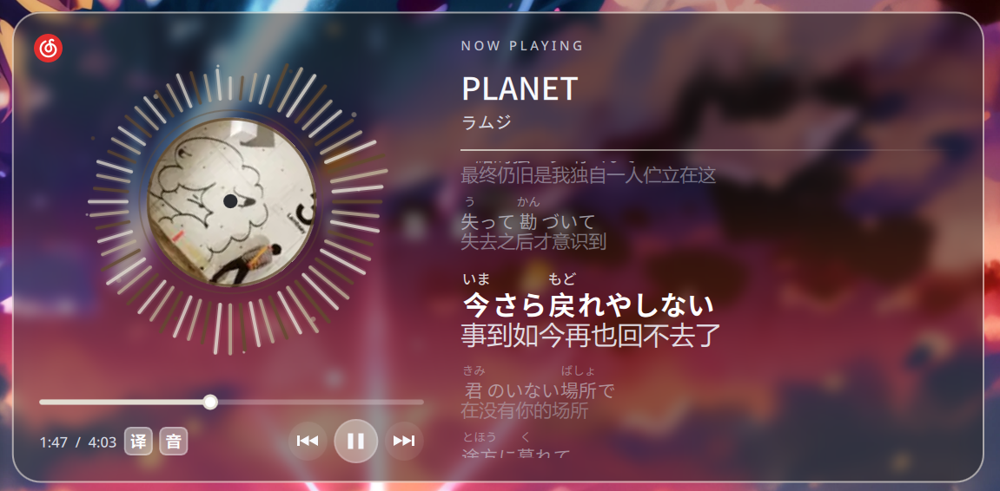

# Panon-Refreshed




English | [简体中文](README.zh-CN.md)

Audio spectrum, rotating album artwork, synchronized lyrics and standard MPRIS
controls for KDE Plasma, with separate desktop and compact panel layouts.

**Plasma 6 only. Plasma 5 is unsupported.**

## Installation and dependencies

Linux and Plasma 6 are required, with Qt Quick/Controls/Layouts, Kirigami,
KCMUtils, Plasma5Support and the Qt WebSockets QML module.
Python 3.10+ needs the packages in `requirements.txt`; optional Japanese readings
use `requirements-readings.txt`. Prefer distribution packages, or select a
virtual environment's interpreter in the settings. Building dbus-python may
require D-Bus and GLib development packages. Panon-Refreshed does not require Intel MKL.

Audio capture requires `pactl`, `parec` and PulseAudio or PipeWire's PulseAudio
compatibility service. Audio failure does not disable media metadata/controls.
Qt5Compat GraphicalEffects is optional: without it wallpaper blur is omitted and
the album falls back to a circular Canvas mask.

```sh
kpackagetool6 --type Plasma/Applet --install .
# For an existing installation:
kpackagetool6 --type Plasma/Applet --upgrade .
```

Reload the widget after upgrading. Use **Check dependencies** in its settings,
or run `python3 -m panon.backend.doctor` from `contents/scripts`.

## Optional exact-ID lyrics integrations

Optional bridges support `netease-cloud-music-web-player` and the tested QQ Music
1.1.8 / Electron 43 build, reading lyrics by verified song ID without title search.
In **Music integrations**, auto-detect the player paths and update its separate
`.desktop` launcher, then fully quit the player (including its tray process) and
reopen it through the **Panon** menu entry; upstream files and original launchers
remain unchanged.
After moving the project or changing player paths, update that launcher again;
generic spectrum and MPRIS controls work without these bridges.

## Verification status

Actual desktop verification: Arch Linux, Plasma 6.7.5, Qt 6.11.2, Python 3.14,
Wayland. The metadata minimum is a loading declaration, not proof that every
Plasma 6 minor release has been tested.
